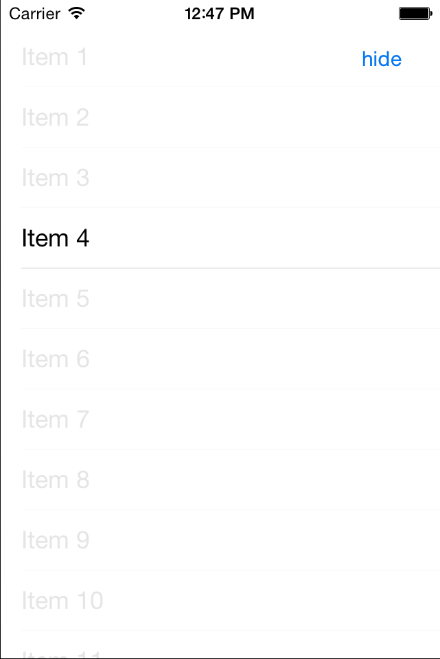

eLBeeIsolator
=============

Isolate a view by animation

Quick screenshot



### Youtube Video
Here is a short video showing the animation in a table view:
[](https://www.youtube.com/watch?v=OCBW07jk0YM)

## Overview

##### initWithParentView:havingTableView:willStartCompletion:didAnimateCompletion:withCompletion:

Initializes an allocated **eLBeeIsolator** object using a *Parent View* (**required**), a *Table View* that resides in the *Parent View*, alng with the 3 available completion blocks: *willStartBlock*, *didAnimateBlock*, *didIsolateBlock*

**Parameters**
* *parentView* `UIView *`
  * The `UIView` that should be considered the primary parent of the view you want to isolate
  * This will typeically just self.view

* *tableView* `UITableView *`
  * A `UITableView` should be supplied if the view to be isolated is a `UITableViewCell`
    * If it is a cell, then this parameter is **required**
    * Otherwise, it is optional and be set to `nil`

* *willStartBlock* `^block`
  * The block recieves a `BOOLEAN` *itemIsBeingIsolated*
  * A completion block to be called *before* the view is (de)isolated
    * Useufl for when you'd like to prepare other views (animate the navigation hidden for instance) before hand

* *didAnimateBlock* `^block`
  * The block recieves a `BOOLEAN` *itemIsBeingIsolated*
  * A completion block called *after* animating the isolated view

* *didIsolateBlock* `^block`
  * The block recieves a `BOOLEAN` *itemIsBeingIsolated*
  * A completion block to be called once isolation of the view is complete


**Additional Initializers**

```objc
-(instancetype)initWithParentView:havingTableView:didAnimateCompletion:withCompletion:
```
```objc
-(instancetype)initWithParentView:havingTableView:withCompletion:
```
```objc
-(instancetype)initWithParentView:havingTableView
```

```objc
-(instancetype)initWithParentView
```


## Extras Included
There are a bunch of other helper categories and stuff added to this guy - mainly just to add them to a repo for later use if I wanted em.  I'm just too lazy right now to list them all out.  So - seek and destroy at will!

### Note
There are many ways to do this same affect.   A much cleaner/better way would be to just transition to a new View as the animation.  This code is just an alternative to that ( and also just me muxing around ).
